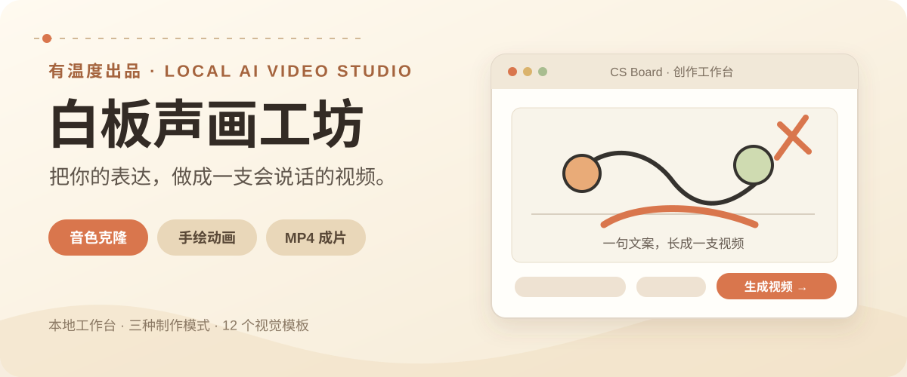
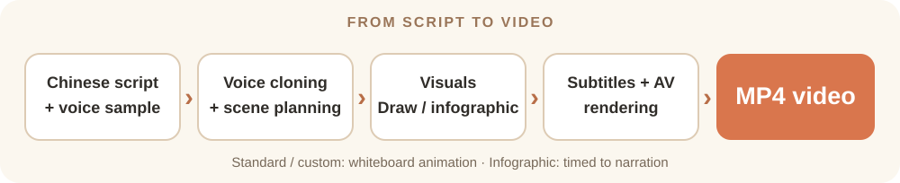

[](README.md)
[](README.en.md)
[](https://x.com/ChenshuoAI)

🚀 **[Make a video from your script](#install)**

[](#install)

# CS Board · Whiteboard Video Studio

**Turn your ideas into a video that speaks.** Add a reference voice and a Chinese script, then choose a visual template or provide character and style references. CS Board connects voice cloning, scene planning, illustration, hand-drawn animation, subtitles, and audio/video rendering into an MP4.

It runs as a local AI video workspace. Project files, API keys, job history, and rendered videos stay on your machine by default. A team on the same local network can share the production queue.



| Mode | What you provide | Best for |
| --- | --- | --- |
| **Standard** | Reference audio, Chinese script, visual template | Explainers, narrated stories, course promos. |
| **Custom reference** | Add a style image and character references | Consistent characters, branded series. |
| **Dynamic infographic** | Script and narration timing | Opinions, business analysis, teaching. |

## See the output

This animation is an example included in the repository. [Browse the example assets](examples/).


The [Chinese README](README.md#界面预览) also shows real screenshots of the voice library, style library, job history, task details, IndexTTS settings, and image generator. The 33 voices shown there were imported on the author's machine; they are **not bundled** with a fresh installation.

## Install

### Requirements

| Component | Requirement |
| --- | --- |
| Operating system | Windows 10/11, or macOS 15+ for the current Remotion video renderer. |
| Runtime | Python 3.11+, Node.js 22.13+, FFmpeg and FFprobe on `PATH`. |
| Voice | A reachable IndexTTS 2.5 Gradio or FastAPI service. |
| Models | An OpenLux API key with access to text and image models. |

On macOS, Homebrew can install the local runtimes:

```bash
brew install python@3.13 node ffmpeg
```

Clone this repository, then install dependencies from its root.

**macOS:**

```bash
git clone https://github.com/ChenShuo2004/cs-board.git
cd cs-board
python3.13 scripts/prepare_env.py
.venv/bin/python -m pip install -r webapp/requirements.txt
(cd web && npm ci)
./start-webapp.sh
```

**Windows PowerShell:**

```powershell
git clone https://github.com/ChenShuo2004/cs-board.git
cd cs-board
python scripts/prepare_env.py
.\.venv\Scripts\python.exe -m pip install -r webapp\requirements.txt
Push-Location web
npm ci
Pop-Location
.\start-webapp.ps1
```

Open [http://127.0.0.1:13000/](http://127.0.0.1:13000/). The web version and the macOS app use the same local ports (`13000` and `18765`), so quit **CSBoard.app** before starting the web version.

In **API Settings**, enter and test your OpenLux key, text and image models, and IndexTTS endpoint. Then upload a clean 10–30 second single-speaker voice sample and paste at least 10 Chinese characters. See the [Chinese setup guide](README.md#首次配置) for optional image credentials, output paths, and TTS parameters.

## What is included

| Feature | Details |
| --- | --- |
| Voice library | Store, preview, search, rename, and reuse your own local reference voices. |
| Visual style library | 12 built-in templates plus editable custom styles and preview images. |
| Character references | One style reference and up to five characters, with one to three images per character. |
| Rendering controls | `16:9`, `9:16`, or `1:1`; subtitle control and four drawing-density levels. |
| Job history | Search, inspect, reuse, cancel, and delete jobs; intermediate checkpoints support recovery. |
| Image generator | Make and download a PNG outside the video workflow at `/image-generator`. |

For the full feature list and all 12 visual previews, see the [Chinese README](README.md#核心能力).

## Repository and local data

```text
assets/          Drawing and visual assets
docs/            Screenshots and workflow documentation
examples/        Whiteboard animation examples
scripts/         Environment setup and rendering utilities
tests/           Queue, recovery, and timing tests
video_renderer/  Remotion renderer
web/             React frontend
webapp/          FastAPI backend
```

Local configuration, reference voices, job files, and rendered videos are stored under `.webapp/`, which Git ignores. Keep API keys and private source media out of issues and commits; see [SECURITY.md](SECURITY.md).

## Star history

[](https://star-history.com/#ChenShuo2004/cs-board&Date)

## License

[MIT](LICENSE) · [Chinese documentation](README.md) · [Follow the author on X](https://x.com/ChenshuoAI)
